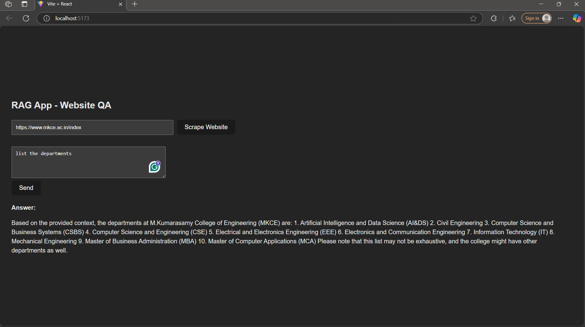
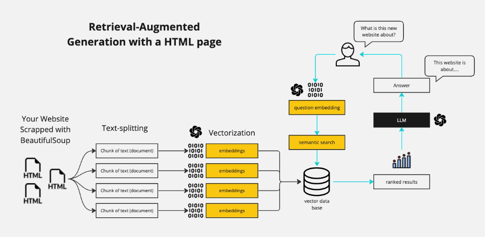

# 🧠 Web RAG Chatbot with React + Flask + Groq

This is a full-stack Retrieval-Augmented Generation (RAG) application that lets users ask questions about web content. It uses a React frontend and a Flask backend integrated with Groq's LLaMA3 model to generate context-aware answers from any web URL using LangChain's `WebBaseLoader`.


## 🚀 Features

- 🌐 **Scrape any website** and convert it into vector embeddings
- 🧠 **Groq-powered LLM** (LLaMA3) for fast, high-quality responses
- 🔍 **Retrieval-Augmented Generation (RAG)** pipeline using LangChain
- 🗣️ **Context-aware chat** with history tracking
- 📄 **Download chat as PDF**
- 🔗 **Cross-origin (CORS)** enabled for local development
- 🔧 Fully configurable using `.env`

---

## 🛠️ Technologies Used

- **Frontend:** React.js
- **Backend:** Flask (Python)
- **LLM:** Groq LLaMA3 via LangChain
- **Vector DB:** Chroma
- **Embeddings:** HuggingFace (`all-MiniLM-L6-v2`)
- **PDF Generator:** FPDF
- **Environment Management:** `dotenv`

---

## ⚙️ Setup Instructions

### 📌 Prerequisites

- Node.js + npm
- Python 3.8+
- Groq API key ([Sign up for Groq](https://console.groq.com/))

---

### 🔧 Backend Setup (Flask)

```bash
cd backend
python -m venv venv
source venv/bin/activate   # On Windows: venv\Scripts\activate
pip install -r requirements.txt
```
### 📄 Create a .env file
```ini
GROQ_API_KEY=your_groq_api_key_here
DOCUMENT_URL=https://example.com
```
### ▶️ Run Flask App
```bash
python app.py
```
The Flask server will run at http://localhost:5000.

### 💻 Frontend Setup (React)
```bash
cd frontend
npm install
```
### ▶️ Start React App
```bash
npm start
```
Frontend will run at http://localhost:3000.

### 🧪 Example Usage
Enter a question about a specific website (configured in .env)

The backend scrapes, chunks, and vectorizes the page

Your query + history is processed through Groq LLaMA3

You receive a highly relevant answer!
---
### 📸 Architecture
.


---
### 🙌 Acknowledgments
LangChain

Groq

HuggingFace

```yaml

Let me know if you'd like to:
- Add deployment instructions (e.g., Vercel, Render, Railway)
- Include real screenshots
- Support file upload or multi-URL scraping

I can also generate a `requirements.txt` or frontend template if needed.
```

